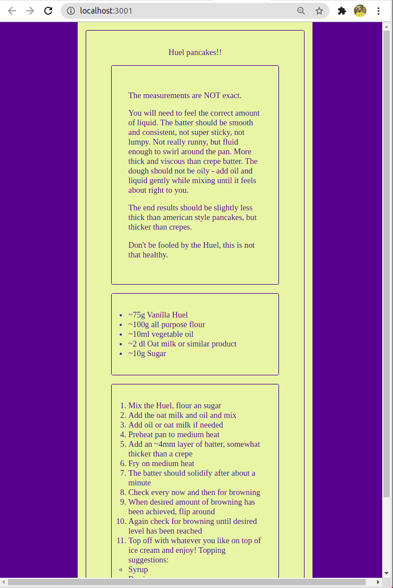

# The One Recipe Website

Create yet another recipe website!

Before you start, have a little look at the files of this project and try to take notice how they are different from the default files!

Decide on whatever recipe you want to show and create whatever style you want.

## Rules

- Set a custom page title
- Make at least the following components:
    - A component for your recipe title
    - A component for your ingredients list
    - A component for your steps
    - A component for the website footer (not featured in the example image)

## Example solution

🦜